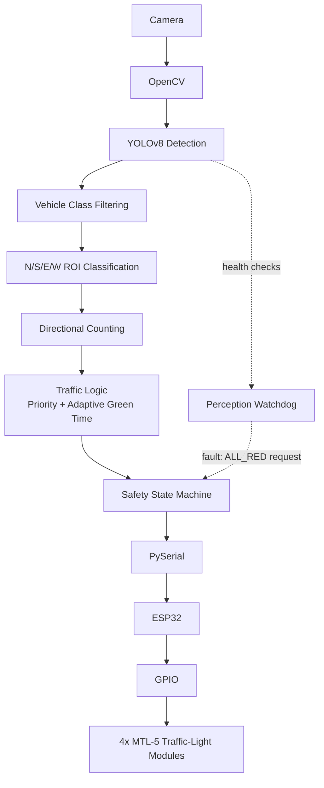
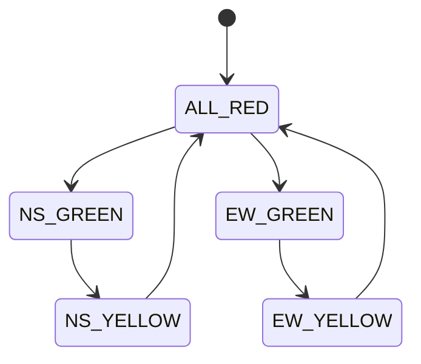

# EDGEGUARD

**AI-powered, hardware-in-the-loop adaptive traffic control prototype.**

EDGEGUARD observes a four-way intersection with a camera, detects and counts vehicles per direction using YOLOv8, computes adaptive signal timing, validates every transition through a deterministic safety state machine, and executes the validated command on an ESP32 driving physical traffic-light modules.


---

## Table of Contents

- [Core Design Principle](#core-design-principle)
- [System Architecture](#system-architecture)
- [Features](#features)
- [Project Status](#project-status)
- [Repository Structure](#repository-structure)
- [Module Overview](#module-overview)
- [Traffic Logic](#traffic-logic)
- [Safety State Machine](#safety-state-machine)
- [Serial Protocol](#serial-protocol)
- [Perception Watchdog](#perception-watchdog)
- [Hardware](#hardware)
- [Getting Started](#getting-started)
- [Testing](#testing)
- [Benchmarking](#benchmarking)
- [Phase 1 Demonstration Goals](#phase-1-demonstration-goals)
- [Author](#author)

---

## Core Design Principle

> **AI never directly controls traffic-light GPIO.**

```
AI PERCEPTION  →  TRAFFIC DECISION  →  SAFETY VALIDATION  →  SERIAL COMMUNICATION  →  ESP32 HARDWARE EXECUTION
```

YOLOv8 is used strictly for **perception**: it detects and counts vehicles. Python logic converts those counts into a priority and timing decision. A deterministic state machine then validates that the requested transition is safe. Only validated commands are sent over serial to the ESP32, which alone is responsible for GPIO execution.

This separation keeps the safety-critical path deterministic and auditable, regardless of what the perception model outputs.

---

## System Architecture



| Layer | Component | Role |
|---|---|---|
| Perceive | `vehicle_detection.py` | Camera input, YOLOv8 inference, ROI assignment, counting |
| Decide | `traffic_logic.py` | Priority and adaptive green-time calculation |
| Check | `watchdog.py` | Perception health monitoring |
| Validate | `controller.py` | Deterministic safe state transitions |
| Transmit | `serial_comm.py` | Serial commands and heartbeat |
| Execute | ESP32 firmware | Command parsing, GPIO control, heartbeat failsafe |
| Output | MTL-5 modules | Physical traffic signals |

---

## Features

**Computer vision**
- Live camera capture with OpenCV
- YOLOv8n vehicle detection (cars, motorcycles, buses, trucks), confidence threshold 0.5
- Four polygonal ROIs (North, South, East, West); vehicles assigned by bounding-box center
- Live overlay: boxes, labels, confidence, centers, ROIs, counts, priority, green times, watchdog status

**Traffic intelligence**
- Opposing-direction aggregation (`NS = N + S`, `EW = E + W`)
- Priority selection (`NS`, `EW`, or `EQUAL`)
- Adaptive green timing: `clamp(10 + count × 2, 10, 60)` seconds

**Safety**
- Deterministic five-state traffic state machine
- Direct opposing-green transitions rejected
- Perception watchdog requesting `ALL_RED` on critical faults
- Serial heartbeat for ESP32 communication-loss failsafe

---

## Project Status

EDGEGUARD is a **Phase 1 hardware-in-the-loop prototype currently transitioning from completed PC-side control software to ESP32 and physical hardware integration.** It is not yet a finished hardware system.

| Component | Status |
|---|---|
| Camera + YOLOv8 pipeline | Implemented, tested |
| N/S/E/W ROI counting | Implemented, tested |
| Traffic logic | Implemented |
| Perception watchdog | Implemented, tested |
| Safety state machine | Implemented, tested |
| Serial communication layer | Implemented; loads without ESP32 |
| PC-side integration test (fake ESP32) | Passing |
| ESP32 firmware | Pending |
| GPIO implementation | Pending |
| MTL-5 wiring and physical testing | Pending |
| ESP32 heartbeat failsafe | Pending |
| Emergency priority (`emergency.py`) | Pending |
| Benchmarking (`benchmark.py`) | Pending |
| Full hardware-in-the-loop end-to-end test | Pending |

> The integration test uses a **fake serial receiver**. It validates the PC-side pipeline only. It does not validate ESP32 firmware, real serial communication, GPIO, or MTL-5 behavior.

---

## Repository Structure

```
EDGEGUARD/
├── software/
│   └── python/
│       ├── vehicle_detection.py   # Perception: camera, YOLOv8, ROI counting
│       ├── traffic_logic.py       # Priority and adaptive green timing
│       ├── watchdog.py            # Perception health monitoring
│       ├── controller.py          # Deterministic safety state machine
│       ├── serial_comm.py         # PySerial + heartbeat
│       ├── emergency.py           # (planned) emergency priority
│       ├── benchmark.py           # (planned) performance measurement
│       └── test_integration.py    # PC-side integration test (fake ESP32)
├── tests/
│   ├── test_traffic_logic.py
│   └── test_state_machine.py
├── hardware/
│   ├── esp32/
│   │   └── firmware/              # ESP32 Arduino firmware (pending)
│   └── wiring/                    # Wiring documentation
├── assets/
├── README.md
└── requirements.txt
```

---

## Module Overview

### `vehicle_detection.py` — Perceive
Reads frames via OpenCV, runs `yolov8n.pt`, keeps only COCO vehicle classes (2 car, 3 motorcycle, 5 bus, 7 truck), assigns each detection to a directional ROI by bounding-box center, and renders the live monitoring window.

### `traffic_logic.py` — Decide
Pure functions that turn directional counts into a decision dictionary containing totals, priority, and per-axis green times.

### `watchdog.py` — Check
`PerceptionWatchdog` validates frames, inference time, and count data, and flags faults.

### `controller.py` — Validate
`TrafficController` enforces the legal state sequence and rejects unsafe transitions.

### `serial_comm.py` — Transmit
`SerialCommunicator` sends newline-terminated commands at 115200 baud and runs a 1-second heartbeat in a daemon thread.

---

## Traffic Logic

```
NS_total = North + South
EW_total = East  + West

priority = NS     if NS_total > EW_total
           EW     if EW_total > NS_total
           EQUAL  otherwise

green_time = clamp(10 + traffic_count × 2, MIN_GREEN=10, MAX_GREEN=60)
```

**Example**

| Input | Value |
|---|---|
| North / South / East / West | 8 / 3 / 15 / 2 |
| NS total | 11 |
| EW total | 17 |
| Priority | **EW** |
| NS green | 32 s |
| EW green | 44 s |

On `EQUAL`, the controller grants green to the opposite axis of the last green direction (a deterministic tie-break).

---

## Safety State Machine

**States:** `ALL_RED` (initial), `NS_GREEN`, `NS_YELLOW`, `EW_GREEN`, `EW_YELLOW`



Direct opposing transitions such as `NS_GREEN → EW_GREEN` are rejected:

```
Invalid transition: NS_GREEN -> EW_GREEN
```

---

## Serial Protocol

- **Baud rate:** 115200
- **Framing:** `COMMAND\n`
- **Heartbeat interval:** 1 second

| Command | Meaning |
|---|---|
| `NS_GREEN` | North/South green, East/West red |
| `NS_YELLOW` | North/South yellow, East/West red |
| `EW_GREEN` | East/West green, North/South red |
| `EW_YELLOW` | East/West yellow, North/South red |
| `ALL_RED` | All directions red (safe state) |
| `HEARTBEAT` | Liveness signal for the ESP32 failsafe |

If the heartbeat stops, the ESP32 firmware is intended to detect the timeout and move to a safe state (`ALL_RED`). *(Firmware pending.)*

---

## Perception Watchdog

| Check | Fault raised |
|---|---|
| `None` camera frame | `CAMERA_FRAME_INVALID` |
| Empty frame | `CAMERA_FRAME_EMPTY` |
| Inference time over limit (default 1.0 s) | `INFERENCE_TIMEOUT` |
| Malformed count data | `COUNT_DATA_INVALID` |
| Negative count | `NEGATIVE_COUNT` |
| Frame age over limit (default 2.0 s) | `STALE_CAMERA_FRAME` |

On a critical fault the system logs `[SAFETY] ALL_RED REQUESTED`. Stale-frame checking is available and may be wired explicitly into the main loop during final hardening.

---

## Hardware

| Item | Quantity |
|---|---|
| ESP32 DevKit V1 | 1 |
| SP Electron MTL-5 traffic-light modules | 4 |
| Breadboard | 1 |
| Jumper wires | as required |
| USB cable | 1 |

```
Laptop / Python
      │  USB Serial
      ▼
    ESP32
      │  GPIO
      ▼
4 × MTL-5 Traffic-Light Modules
```

Pin mapping and wiring diagrams will be documented in `hardware/wiring/` once physical testing is complete.

---

## Getting Started

### Prerequisites
- Python 3.10+
- A webcam
- Arduino IDE (for ESP32 firmware, once available)

### Installation

```bash
git clone https://github.com/<your-username>/EDGEGUARD.git
cd EDGEGUARD
python -m venv venv
# Windows
venv\Scripts\activate
# Linux / macOS
source venv/bin/activate

pip install -r requirements.txt
```

### Run the live perception pipeline

```bash
python software/python/vehicle_detection.py
```

Press `q` in the OpenCV window to quit (if implemented in your loop).

### Run the PC-side integration test

```bash
python software/python/test_integration.py
```

Expected output includes:

```
NS Total = 11
EW Total = 17
Priority = EW
NS Green = 32s
EW Green = 44s
[FAKE ESP32] Received: EW_GREEN
INTEGRATION TEST PASSED
```

---

## Testing

```bash
pytest tests/
```

| Test | Scope |
|---|---|
| `tests/test_traffic_logic.py` | Totals, priority, green-time clamping, input validation |
| `tests/test_state_machine.py` | Valid sequences and invalid-transition rejection |
| `software/python/test_integration.py` | Traffic input → decision → state machine → serial command (fake ESP32) |

Hardware-in-the-loop tests will be added once ESP32 firmware and wiring are complete.

---

## Benchmarking

`benchmark.py` is planned to measure YOLO inference latency, processing latency, FPS, and controller overhead. The target is control-logic overhead under **25 ms**.

| Metric | Result |
|---|---|
| YOLOv8n inference latency | _Not yet measured_ |
| Processing latency | _Not yet measured_ |
| FPS | _Not yet measured_ |
| Controller overhead | _Not yet measured_ |

No performance claims are made until measured.

---

## Phase 1 Demonstration Goals

1. Live camera feed with YOLOv8 detections, labels, and bounding boxes
2. Four directional ROIs with N/S/E/W counts and NS/EW totals
3. Priority and adaptive green-time display
4. Watchdog status
5. Deterministic state transitions and serial commands
6. ESP32 response and physical traffic-light response
7. Heartbeat behavior and safe response to perception or communication failure
8. Emergency priority (after `emergency.py` is implemented)
9. Performance measurements (after `benchmark.py` is implemented)

---

## Author

**Jay** — B.Tech CSE, VIT-AP University

---

## License

Add a license of your choice (for example MIT) as a `LICENSE` file in the repository root.
